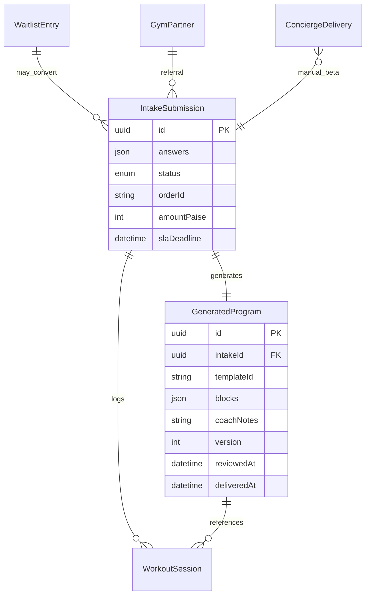

# Data Model

Phase 1 uses a **JSON file store** at `data/db.json`. Types defined in `src/lib/types.ts`.

## Entity diagram



## Collections

### `waitlist`

Pre-launch signups with optional ₹99 deposit.

| Field | Type | Notes |
|-------|------|-------|
| id | UUID | |
| email, name | string | |
| goal | GoalId | |
| city | string? | |
| depositPaid | boolean | |
| depositAmountPaise | number | |
| referralCode | string? | Gym partner code |
| createdAt | ISO datetime | |

### `intakes`

Paid questionnaire submissions.

| Field | Type | Notes |
|-------|------|-------|
| id | UUID | |
| answers | IntakeAnswers | Full questionnaire payload |
| status | IntakeStatus | See status machine below |
| paymentId, orderId | string? | Razorpay refs |
| amountPaise | number | |
| slaDeadline | ISO datetime | createdAt + 12h |
| createdAt, updatedAt | ISO datetime | |

**IntakeStatus:** `draft` → `pending_payment` → `paid` → `pending_review` → `approved` → `delivered` | `rejected` | `refunded`

### `programs`

Generated training programs linked 1:1 to intakes.

| Field | Type | Notes |
|-------|------|-------|
| id | UUID | |
| intakeId | UUID | FK to intakes |
| templateId, templateName | string | |
| coachNotes | string | Editable by reviewer |
| blocks | ProgramBlock[] | Week/day/exercise rows |
| sheetUrl, pdfPath | string? | Set on delivery |
| version | number | Increment on regeneration |
| reviewerId, reviewedAt | | Set on approve |
| deliveredAt | | Set on deliver |

### `sessions` (Phase 2 foundation)

Workout log entries.

| Field | Type | Notes |
|-------|------|-------|
| id | UUID | |
| email | string | Athlete identifier |
| week, day | number | Program position |
| exercise | string | |
| sets | WorkoutSet[] | weight, reps, rpe, rir |
| completedAt | ISO datetime | |

### `prs`

Personal records derived from sessions.

### `gymPartners`

B2B referral partners — see [gym-partners.md](../growth/gym-partners.md).

### `concierge`

Manual beta deliveries before full MVP — see [concierge-beta-log.md](../coach/concierge-beta-log.md).

### `auditLogs`

Append-only action log: entity, entityId, action, actorId, timestamp, optional diff.

## IntakeAnswers (embedded)

Key fields in `answers` JSON:

- Demographics: name, email, phone, age, gender, heightCm, bodyweightKg
- Training: goal, experience, federation, trainingDays, trainingStyle, gymType
- Lifts: squat1rm, bench1rm, deadlift1rm, meetPrs
- Constraints: injuries[], injuryNotes, equipment{}, meetDate
- Legal: disclaimerAccepted

## Persistence layer

```typescript
// src/lib/db/index.ts
readDb()    // Load + merge with empty defaults
writeDb(db) // Atomic write to data/db.json
updateDb(fn) // Read-modify-write
auditLog()  // Append audit entry
```

**File location:** `data/db.json` (gitignored). Created on first write.

## Future: PostgreSQL migration

Target schema (Neon) when JSON store limits hit (~80+ programs or concurrent writes):

```sql
-- Core tables map 1:1 from JSON collections
users, athlete_profiles, intake_submissions, programs,
program_templates, audit_logs
-- Phase 2: workout_sessions, set_logs, personal_records
```

Migration trigger:

- Concurrent admin + webhook writes cause race conditions
- Need SQL reporting for SLA dashboards
- Backup/PITR requirements for production

Set `DATABASE_URL` and introduce Prisma per ADR-0002 migration plan.

## Indexes (future PostgreSQL)

- `(intake_submissions.status, sla_deadline)` — review queue
- `(audit_logs.entity_id, timestamp DESC)` — audit trail

## Related

- [api.md](api.md)
- [adr/0002-json-store-bootstrap.md](adr/0002-json-store-bootstrap.md)
