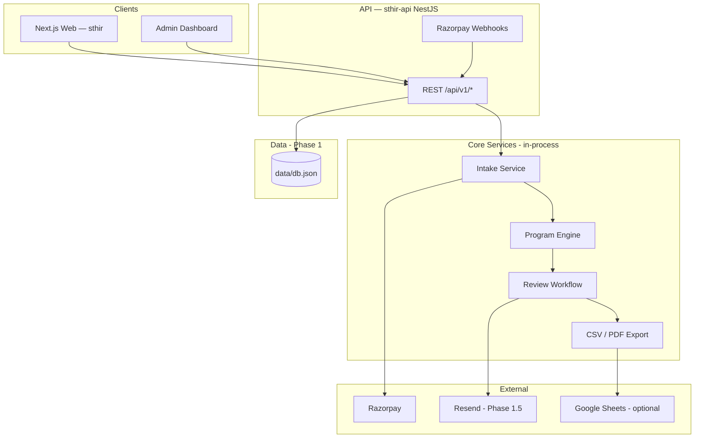

# Architecture Overview

Phase 1 architecture — **sthir-api** (NestJS) + **sthir** (Next.js frontend).

## System diagram

## Architecture principles

1. **Split frontend + API** — Next.js on Vercel, NestJS API on Railway/Render (ADR-0001 updated)
2. **API versioning** — all routes under `/api/v1`
3. **Idempotent webhooks** — Razorpay payment events safely replayable
4. **Human review gate** — no auto-delivery (ADR-0003)
5. **Bootstrap storage** — JSON file store for speed; PostgreSQL migration path documented (ADR-0002)

## Stack (implemented)

| Layer | Choice | Notes |
|-------|--------|-------|
| Frontend | Next.js 16 App Router, React 19, Tailwind 4 | Repo: `sthir` — Vercel |
| Backend | **NestJS 11** (`sthir-api`) | Separate repo — Railway/Render |
| Forms | React Hook Form + Zod (API-side) | Intake validation on API |
| Data | JSON / Neon / Vercel Blob | Via `sthir-api` database layer |
| Payments | Razorpay | Webhooks → API |
| PDF | `@react-pdf/renderer` | API export on deliver |
| Tests | Vitest | Program engine in `sthir-api` |

## Stack (planned)

| Layer | Choice | Phase |
|-------|--------|-------|
| Database | PostgreSQL (Neon) | Post-80 programs |
| Auth | Clerk or Supabase magic link | Phase 1.5 |
| Jobs | Inngest / Trigger.dev | SLA cron, email |
| Email | Resend | Delivery notifications |
| Analytics | PostHog | Funnel tracking |
| Error tracking | Sentry | Production |
| CI/CD | GitLab CI → Railway (API) + Vercel (web) | See runbook-deploy |

## Request flow — happy path

1. Athlete completes intake → `POST /api/v1/intake`
2. Razorpay order created → athlete pays
3. Webhook `POST /api/v1/webhooks/razorpay` → status `pending_review`, program draft generated
4. Coach opens admin queue → reviews program
5. Coach approves → `POST /api/v1/admin/programs/:id` action `approve`
6. Coach delivers → action `deliver` → CSV + PDF generated
7. Athlete downloads via program endpoints

## Security (Phase 1)

- Admin routes: `x-admin-key` header (production)
- Razorpay webhook HMAC verification
- No PII in client-side logs
- `data/db.json` gitignored — never commit athlete data

## Scalability path

| Scale | Architecture |
|-------|--------------|
| <1k users | NestJS on Railway, Neon/Blob, manual review |
| 1k–20k | PostgreSQL, Redis cache, background jobs |
| 20k+ | Extract notification + program services |

See ADRs in [adr/](adr/) for decision history.

## Related

- [data-model.md](data-model.md)
- [api.md](api.md)
- [../operations/runbook-deploy.md](../operations/runbook-deploy.md)
