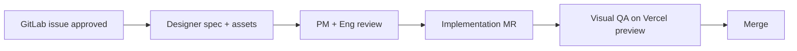

# Founding Team & Roles

Phase 1 team structure. Update when hires join or scope shifts.

## Team (Phase 1)

| Role | Owner | Focus | Phase 1 commitment |
|------|-------|-------|-------------------|
| **CEO / Product** | Founder | Vision, pricing, gym partnerships, coach credibility | Full-time |
| **Engineering** | Founder (initially) | Next.js monolith, API, program engine, deploy | Full-time |
| **Coach Ops** | Founder (initially) | Program review, 12h SLA, template quality | Part-time until 30+ programs/week |
| **Designer** | TBD hire / contractor | Brand, conversion UX, design system | Part-time → full-time at launch |

---

## Designer — role definition

### Why now (before scale)

Phase 1 moat is **trust**, not code. A designer makes the product feel credible to warehouse-gym lifters — not like a generic fitness app. Landing + intake conversion directly affects the 80-program gate.

### Owns

| Area | Deliverables |
|------|--------------|
| **Brand** | Logo, wordmark, color/type system, tone (strong, Indian, no bro-science) |
| **Marketing site** | Landing, pricing, FAQ, waitlist — mobile-first, LCP-friendly |
| **Intake UX** | 6-step questionnaire — reduce drop-off, clear federation/injury fields |
| **Coach admin** | Review queue UX — approve/deliver in <3 clicks |
| **Design system** | Component spec + tokens doc (colors, type, spacing) — maps to Tailwind |
| **Partner assets** | Gym referral one-pagers, WhatsApp share cards, meet-day posters |

### Does not own (Phase 1)

- Program template logic (Coach Ops + Engineering)
- Copy that makes medical/injury claims (Legal + Coach Ops review)
- Backend or API design (Engineering)

### Success metrics (first 90 days)

| Metric | Target |
|--------|--------|
| Landing → waitlist CTA click | ≥ 8% |
| Intake start → payment | ≥ 35% |
| Mobile usability (intake) | No step > 20% drop-off |
| Brand recall (beta survey) | "Looks like a serious PL brand" ≥ 70% agree |

### Workflow with Engineering

1. Every UI story starts as a GitLab issue with persona + success metric.
2. Designer delivers spec in the issue before Eng picks up (S/M size) — **their own tools** (Penpot, Adobe, Sketch, etc.); no shared Figma account required.
3. XS cosmetic changes: designer can annotate in issue; no full spec required.
4. Design tokens map to Tailwind in `src/app/globals.css` — no one-off hex in components.
5. Visual sign-off on Vercel preview URL before merge.

### Handoff to Engineering (no Figma required)

Designer attaches to the GitLab issue:

| Deliverable | Format |
|-------------|--------|
| Mobile + desktop mockups | PNG/WebP or PDF export |
| Logo & icons | SVG where possible |
| Color + typography tokens | Short markdown table or `docs/product/design-tokens.md` PR |
| Spacing / component notes | Issue comment or 1-page spec |
| Export assets | `public/brand/` via MR, or shared drive link |

Eng implements from exports + token doc. **Code is source of truth** after merge — designer does not need repo access unless they want it.

### Approval matrix (design-related)

| Change type | Approvers |
|-------------|-----------|
| Copy / micro-UX | PM |
| New page or funnel step | PM + Designer |
| Pricing / checkout UI | PM + CEO |
| Brand identity change | CEO + Designer |
| Injury/disclaimer UI | PM + Coach Ops + Legal |

### Tooling

**Company does not provide Figma.** Designer uses whatever they prefer.

| Who | Tool | Use |
|-----|------|-----|
| Designer | Own choice (Penpot, Adobe XD, Illustrator, etc.) | Mockups, brand, flows |
| Team | GitLab issues | Specs, assets, approval |
| Engineering | Repo + Vercel preview | Implementation + visual QA |

Optional later: if team adopts a shared tool, update this section — not required for Phase 1.

### Hire profile (contractor or part-time)

- Portfolio: consumer product or sports/fitness (not only Dribbble shots)
- Strong mobile-first responsive work
- Can work in a design system, not page-by-page mockups
- Bonus: Hindi/English bilingual marketing layouts
- India timezone overlap ≥ 4h

### First 2-week sprint (designer onboarding)

| Week | Deliverable |
|------|-------------|
| 1 | Brand exploration (2 directions) → pick one; landing hero + pricing section |
| 1 | Intake steps 1–3 wireframes |
| 2 | Full intake flow high-fidelity; admin queue screen |
| 2 | Component library v0 (spec + exports); handoff to Eng for landing + intake |

---

## Engineering + hosting split

Designer does not choose infra — documented for team alignment:

| Layer | Where | Notes |
|-------|-------|-------|
| Frontend + API | **Vercel** (same Next.js repo) | Route Handlers = backend; no separate server Phase 1 |
| Frontend | **Vercel** (`sthir`) | Next.js only |
| Backend API | **Railway / Render** (`sthir-api`) | NestJS, long-running |
| Database | **Neon PostgreSQL** | Required before production — JSON store is local-only |
| Payments | **Razorpay** | Webhooks → `api.sthir.in/api/v1/webhooks/razorpay` |
| Files (PDF) | Vercel Blob or S3 (Phase 1.5) | Optional until volume grows |
| Email | Resend (Phase 1.5) | Delivery notifications |

See [architecture/overview.md](../architecture/overview.md) and [runbook-deploy.md](../operations/runbook-deploy.md).

---

## When to expand

| Trigger | Hire |
|---------|------|
| 30+ programs/week | Part-time reviewer coach |
| Launch marketing push | Designer → full-time or agency retainer |
| 80+ paid programs | Full-time engineer #2 |
| Multi-coach queue | Coach Ops lead |

## Related

- [personas.md](personas.md)
- [prd-phase1.md](prd-phase1.md)
- [../growth/gtm-playbook.md](../growth/gtm-playbook.md)
